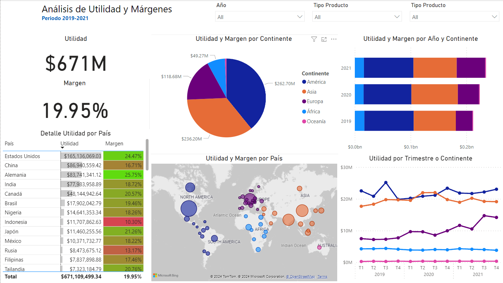

# Analisis de Datos de la base de datos de Venta de Celulares

Esta es una base de datos de ventas de celulares, la cual contiene información de los clientes, los productos y las ventas realizadas. La base datos contiene diferentes datos como el periodo de la venta, el tipo de producto, la cateogria del producto, la región, los ingresos y los gastos.

La base de datos esta estructurada de la siguiente manera:

Tabla Datos
| Periodo | Tipo Producto | Region | Ingresos | Gastos |
|---------|---------------|--------|----------|--------|
| Q1 2019 | Accesorios | AGO - África/Angola | $66,319.70 | $56,708.15 |
| Q1 2019 | Aplicaciones | AGO - África/Angola | $122,357.28 | $77,039.77 |
| Q1 2019 | Celulares | AGO - África/Angola | $265,278.82 | $215,226.21 |
| Q1 2019 | Musica | AGO - África/Angola | $130,447.02 | $86,964.68 |
| Q1 2019 | PC | AGO - África/Angola | $394,602.24 | $326,567.37 |
| ⋮ | ⋮ | ⋮ | ⋮ | ⋮ |

Donde:
- **Periodo**: Es el periodo en el que se realizo la venta.
- **Tipo Producto**: Es el tipo de producto que se vendio.
- **Region**: Es la región en la que se realizo la venta.
- **Ingresos**: Es el monto de ingresos que se obtuvo por la venta.
- **Gastos**: Es el monto de gastos que se tuvo por la venta.

Tabla Productos
| Tipo Producto | Categoria Producto |
|---------------|-------------------|
| Musica | Digital |
| TV | Digital |
| Aplicaciones | Digital |
| PC | Dispositivos |
| Celulares | Dispositivos |
| Tablets | Dispositivos |
| Accesorios | Dispositivos |

Donde:
- **Tipo Producto**: Es el tipo de producto que se vendio.
- **Categoria Producto**: Es la categoria a la que pertenece el producto.

Diagrama Entidad-Relación

Dashboard 

Descargar PBIX [aqui](./dashboard-ventas.pbix)

## Licencia 📝

Este proyecto está bajo la Licencia AGPLv3 - mira el archivo [LICENSE](LICENSE) para detalles.

## Autor 👨‍💻

  <a href="https://github.com/Dylan-Chambi">
  
  
Dylan Chambi

  </a>

